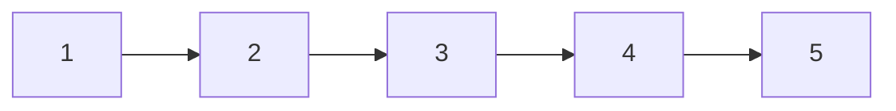
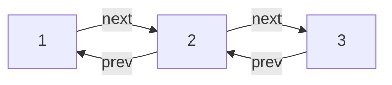

# **자료구조**

연결리스트

> <span style="font-size: 24px; color: #0A7FC7;">연결리스트는 차례로 연결된 노드를 표현해주는 자료구조</span>

---

## Table of contents
- [01. 연결 리스트](#01-연결-리스트)
- [02. 단방향 연결리스트에서 노드 삭제](#02-단방향-연결리스트에서-노드-삭제)
- [03. 재귀 문제](#03-재귀-문제)

---

## **01. 연결 리스트**
연결리스트는 차례로 연결된 노드를 표현해주는 자료구조

- 연결리스트의 장점은 리스트의 시작 지점에서 아이템을 추가하거나 삭제하는 연산을 상수 시간에 확인할 수 있음
  - 특정 애플리케이션에서 유용


### 단방향 연결리스트
단방향 연결리스트에서 각 노드는 다음 노드를 기리킴 



### 양방향 연결리스트
양방향 연결리스트에서 각 노드는 다음 노드와 이전 노드를 함께 가리킴



---

## **02. 단방향 연결리스트에서 노드 삭제**

1. 널 포인터 검사를 반드시 수행
2. 필요하다면, head와 tail 도 갱신해야 함


---

## **03. 재귀 문제**
재귀 호출의 깊이가 n이 될 경우, 해당 재귀 알고리즘은 적어도 O(n) 만큼의 공간을 사용

> 재귀 함수의 깊이가 n인 경우, n번의 함수 호출이 스택에 쌓입니다. 각 호출은 일정량의 메모리를 사용합니다. 따라서 최소 O(n)의 공간 복잡도를 가집니다.

```js
function countdown(n) {
  if (n <= 0) {
    console.log("Done!");
    return;
  } else {
    console.log(n);
    countdown(n - 1);
  }
}

countdown(5);
```


---